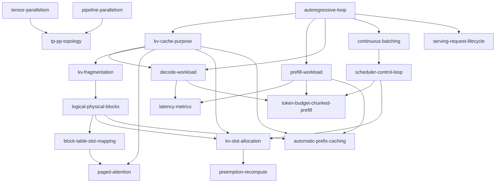

# Route B 首个教学试点：vLLM 概念 DAG

<!-- markdownlint-disable MD013 -->

本目录从关联 [#174（Route B 教学系统采纳）](https://github.com/Eridanus117/agent-control/issues/174)批准的 **17 个概念节点**起步；关联 [#166（个人学习与 KB 内容）](https://github.com/Eridanus117/agent-control/issues/166)的后续自然学习需求先后新增 serving 与 automatic prefix caching 两个节点，当前共 **19 个概念节点**。节点只保存稳定 ID、能力结果、硬先修、辨析关系、教学资产和一个可评分检查；关联 [#170（vLLM 学习单元）](https://github.com/Eridanus117/agent-control/issues/170)及后续长文继续作为叙事资产，不被复制或拆碎。

## 合同与证据边界

- 批准来源：[关联 #174（Route B 教学系统采纳）决定回执](https://github.com/Eridanus117/agent-control/issues/174#issuecomment-5266865760)。
- 节点合同：[关联 #173（Route B 教学系统设计）第三节](https://github.com/Eridanus117/agent-control/blob/5a23f28790fc43ceeab428c20f5e03f40694cdfd/learning/teaching/route-b-teaching-system.md#31-%E6%A6%82%E5%BF%B5%E8%8A%82%E7%82%B9%E7%9A%84%E6%9C%80%E5%B0%8F%E5%90%88%E5%90%8C%E8%AE%BE%E8%AE%A1%E5%BB%BA%E8%AE%AE)。
- 叙事资产：[关联 #170（vLLM 学习单元）固定版本](https://github.com/Eridanus117/agent-control/blob/841aeadcfa0efa82b1ef5524b88f983eeeb15ca1/learning/infra/vllm-and-inference.md)。
- 增量来源：关联 [#166（个人学习与 KB 内容）](https://github.com/Eridanus117/agent-control/issues/166)的 B2 后续单元；只增加 serving 请求生命周期与 automatic prefix caching，不恢复关联 [#174（Route B 教学系统采纳）](https://github.com/Eridanus117/agent-control/issues/174)已经停止的常态教学运行。
- 软件事实固定在 vLLM `v0.27.1`；版本升级、调度器或 KV cache 路径变化时，先重核资产，再沿用检查。
- 本目录只定义路线，不记录学习者状态，也不把路线存在写成“已经掌握”或“教学效果已验证”。

## Mermaid DAG 总览

`tensor-parallelism` 与 `pipeline-parallelism` 是可独立进入的根节点；其余根节点为 `autoregressive-loop`。serving 节点只要求先能追踪自回归请求的多轮边界；automatic prefix caching 节点则要求先会区分 KV 状态、prefill 工作量与物理块，避免把“复用什么、跳过什么、块怎样留存”混为一个机制。图中没有回边，因而全图无环。

## 每条先修边的理由

1. `vllm.autoregressive-loop` → `vllm.kv-cache-purpose`：先知道历史 token 会在后续生成轮次被重复使用，才能判断缓存 K/V 避免了哪部分重算。
2. `vllm.autoregressive-loop` → `vllm.prefill-workload`：先能划分请求的首轮与后续轮次，才能定位 prefill 处理的是哪段 token。
3. `vllm.autoregressive-loop` → `vllm.decode-workload`：先能追踪逐 token 自回归循环，才能解释 decode 的迭代边界。
4. `vllm.kv-cache-purpose` → `vllm.decode-workload`：decode 的核心数据流依赖读取已有 K/V，不会 KV cache 就无法完整追踪该轮前向。
5. `vllm.prefill-workload` → `vllm.latency-metrics`：要把 TTFT 归因到首 token 路径，必须先识别 prefill。
6. `vllm.decode-workload` → `vllm.latency-metrics`：要把 ITL/TPOT 归因到后续 token 路径，必须先识别 decode。
7. `vllm.kv-cache-purpose` → `vllm.kv-fragmentation`：先知道 KV cache 随请求与序列增长，才能分析预留和碎片为何限制并发。
8. `vllm.kv-fragmentation` → `vllm.logical-physical-blocks`：逻辑块与物理块映射是在解决连续预留和碎片问题，先知道问题才能判断这层抽象是否有效。
9. `vllm.logical-physical-blocks` → `vllm.block-table-slot-mapping`：块表保存的正是逻辑块到物理块的映射，必须先能区分两者。
10. `vllm.kv-cache-purpose` → `vllm.paged-attention`：PagedAttention 读写的对象是请求相关 K/V，先要能把它与模型参数分开。
11. `vllm.block-table-slot-mapping` → `vllm.paged-attention`：attention kernel 通过块表与 slot mapping 定位离散 K/V，不会寻址就无法解释分页注意力的执行路径。
12. `vllm.autoregressive-loop` → `vllm.continuous-batching`：continuous batching 的重组边界在生成迭代之间，先要知道一次迭代是什么。
13. `vllm.continuous-batching` → `vllm.scheduler-control-loop`：调度器的 running/waiting 变化是在具体实现动态批次成员，先掌握语义才能读控制流。
14. `vllm.prefill-workload` → `vllm.token-budget-chunked-prefill`：chunked prefill 切分的是尚未完成的 prompt 计算，必须先识别 prefill 工作量。
15. `vllm.decode-workload` → `vllm.token-budget-chunked-prefill`：该策略要在 decode 与 prefill 之间分配预算，必须先知道 decode 的推进单位。
16. `vllm.scheduler-control-loop` → `vllm.token-budget-chunked-prefill`：token budget 是每轮调度的约束，先要知道预算在哪个控制循环中被扣减。
17. `vllm.kv-cache-purpose` → `vllm.kv-slot-allocation`：申请 slots 的目标是容纳本轮新增 K/V，必须先知道缓存的生命周期。
18. `vllm.logical-physical-blocks` → `vllm.kv-slot-allocation`：分配器返回和回收的是物理块，必须先掌握块粒度与逻辑映射。
19. `vllm.scheduler-control-loop` → `vllm.kv-slot-allocation`：由 scheduler 把本轮 token 需求转换成 KV slot 申请，先要能定位调用者与返回路径。
20. `vllm.kv-slot-allocation` → `vllm.preemption-recompute`：抢占由分配失败触发，先会判断失败条件才能解释为何选择牺牲请求。
21. `vllm.tensor-parallelism` → `vllm.tp-pp-topology`：组合二维拓扑前必须先能计算 TP rank 如何共同完成一层。
22. `vllm.pipeline-parallelism` → `vllm.tp-pp-topology`：组合二维拓扑前必须先能计算 PP stage 如何切分层序列。
23. `vllm.autoregressive-loop` → `vllm.serving-request-lifecycle`：先知道一条生成请求会跨多个模型轮次，才能区分 HTTP 请求生命周期、SSE 事件边界与 EngineCore step。
24. `vllm.kv-cache-purpose` → `vllm.automatic-prefix-caching`：先知道 K/V 保存的是请求历史中间状态，才能解释 APC 复用的不是 prompt 文本或最终答案。
25. `vllm.prefill-workload` → `vllm.automatic-prefix-caching`：先能识别 prompt 计算，才能判断命中跳过的是 prefill 而不是后续 decode。
26. `vllm.logical-physical-blocks` → `vllm.automatic-prefix-caching`：在本单元限定的单 KV cache group／非 hybrid 路径中，APC 命中按完整物理块对齐，并通过 block pool 引用与驱逐复用它们；不会块粒度就无法算本范围内的命中边界。

## 节点索引

| 顺序 | id | 学完后的能力 | 节点 |
| --- | --- | --- | --- |
| 1 | `vllm.autoregressive-loop` | 追踪 prompt 到连续输出 token 的轮次和 K/V 使用 | [01](./concepts/01-autoregressive-loop.md) |
| 2 | `vllm.kv-cache-purpose` | 判断 KV cache 保存什么、何时增长与释放 | [02](./concepts/02-kv-cache-purpose.md) |
| 3 | `vllm.prefill-workload` | 从 trace 识别 prefill 并预测 TTFT 影响 | [03](./concepts/03-prefill-workload.md) |
| 4 | `vllm.decode-workload` | 从 trace 识别 decode 并追踪历史 K/V 读取 | [04](./concepts/04-decode-workload.md) |
| 5 | `vllm.latency-metrics` | 把 TTFT、ITL/TPOT 异常定位到对应阶段 | [05](./concepts/05-latency-metrics.md) |
| 6 | `vllm.kv-fragmentation` | 计算预留浪费并辨别内部／外部碎片 | [06](./concepts/06-kv-fragmentation.md) |
| 7 | `vllm.logical-physical-blocks` | 把 token 序列映射到可离散放置的块 | [07](./concepts/07-logical-physical-blocks.md) |
| 8 | `vllm.block-table-slot-mapping` | 从逻辑位置算出物理块与块内 slot | [08](./concepts/08-block-table-slot-mapping.md) |
| 9 | `vllm.paged-attention` | 解释分页 K/V 怎样被 attention 读取 | [09](./concepts/09-paged-attention.md) |
| 10 | `vllm.continuous-batching` | 重排批次时间线并判断请求何时补位 | [10](./concepts/10-continuous-batching.md) |
| 11 | `vllm.scheduler-control-loop` | 追踪 running/waiting、调度输出与完成释放 | [11](./concepts/11-scheduler-control-loop.md) |
| 12 | `vllm.token-budget-chunked-prefill` | 在 decode 与长 prompt 之间分配一轮 token budget | [12](./concepts/12-token-budget-chunked-prefill.md) |
| 13 | `vllm.kv-slot-allocation` | 把本轮 token 需求换算成新增块并识别分配失败 | [13](./concepts/13-kv-slot-allocation.md) |
| 14 | `vllm.preemption-recompute` | 追踪 V1 抢占后释放、回队与重算 | [14](./concepts/14-preemption-recompute.md) |
| 15 | `vllm.tensor-parallelism` | 判断层内切分与 collective 的位置 | [15](./concepts/15-tensor-parallelism.md) |
| 16 | `vllm.pipeline-parallelism` | 判断层切分与 stage 间 activation 流 | [16](./concepts/16-pipeline-parallelism.md) |
| 17 | `vllm.tp-pp-topology` | 计算 TP×PP worker 拓扑并解释通信边界 | [17](./concepts/17-tp-pp-topology.md) |
| 18 | `vllm.serving-request-lifecycle` | 沿 request ID 追踪 HTTP、EngineCore、输出与中止边界 | [18](./concepts/18-serving-request-lifecycle.md) |
| 19 | `vllm.automatic-prefix-caching` | 计算可复用前缀并追踪 hash、引用、驱逐与收益边界 | [19](./concepts/19-automatic-prefix-caching.md) |

## 使用规则

1. 只用 `requires` 判断节点是否可学；`contrastsWith` 只安排辨析，不形成门控边。
2. 每个节点的 `checks` 恰好含一个检索、应用或辨析检查；按 0–2 分评分，2 分通过本节点的即时门控，0–1 分回到失败项对应资产。
3. 通过只代表即时检查证据，不代表延迟保持；学习者状态和复习到期时间由试点运行面另行记录。
4. 资产以固定提交和 vLLM `v0.27.1` 官方材料为准；命中版本失效条件时，现有检查先标为待复核。
